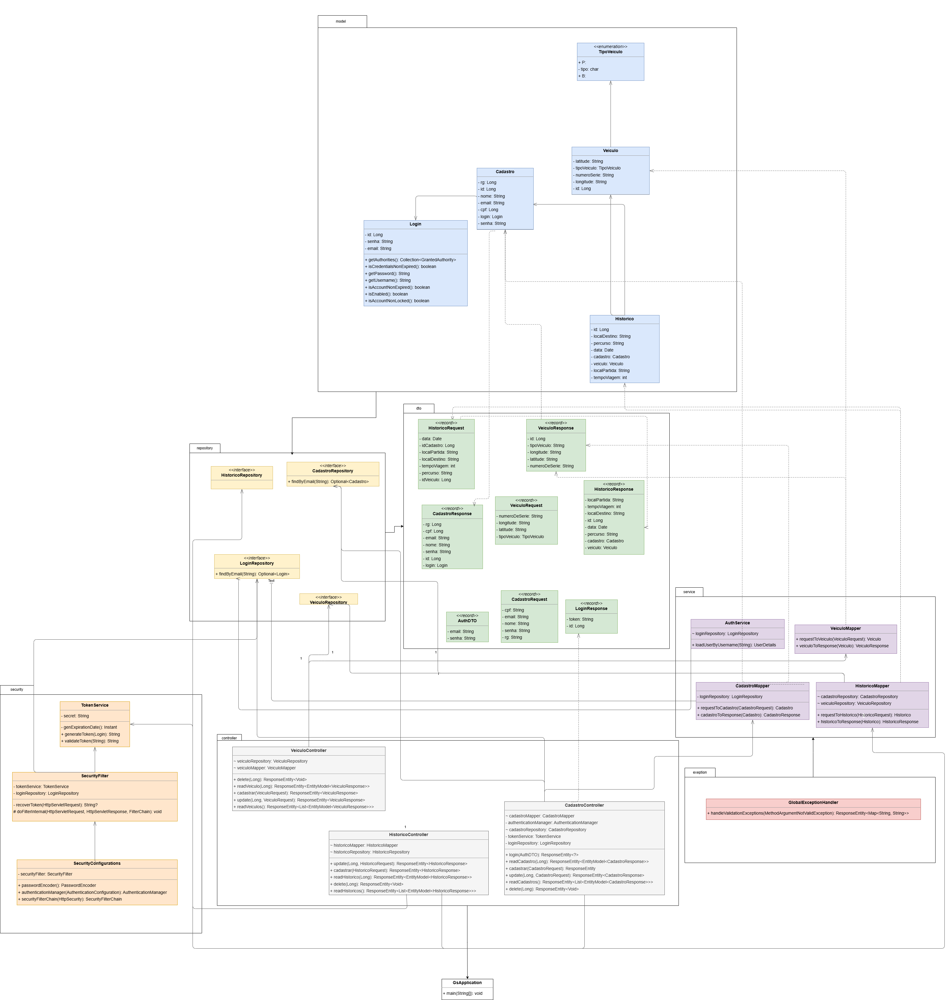
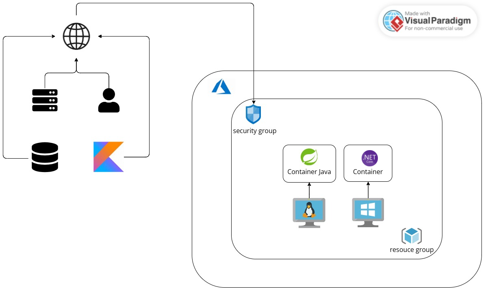

# Green Way 🚲🌱

## Descrição do Sistema
Este projeto aborda a mobilidade sustentável em áreas precárias, promovendo o uso de energia verde através de bicicletas e patinetes compartilhados. O sistema possibilita:

- Cadastro e login de usuários.
- Localização de veículos próximos para locomoção.
- Desbloqueio de veículos utilizando QRCode.
- Visualização de histórico de viagens.
- Gerenciamento da conta do usuário.


A solução combina tecnologias modernas para oferecer um impacto positivo na mobilidade e sustentabilidade, sendo uma alternativa para reduzir emissões de carbono e ampliar o acesso à mobilidade sustentável.

## Relevância e Inovação
- Problema Resolvido: Mobilidade limitada em áreas precárias, reduzindo a dependência de combustíveis fósseis.
- Solução Inovadora: Uso de tecnologia QRCode para desbloqueio rápido e prático de veículos, incentivando o uso de transportes limpos.
- Impacto Positivo: Expansão da acessibilidade em regiões carentes e redução de emissões de CO₂.
- Incorporação Tecnológica: Utilização de Spring Boot, JWT para segurança e autenticação, e deploy na nuvem para acesso global.

## Como Testar a Aplicação
A API pode ser testada de duas formas:

- Na nuvem (deploy na VM da Azure)
- Localmente (em sua máquina)
1. **Testando na Nuvem**
   
O deploy foi realizado em uma máquina virtual da Azure. Utilize a URL abaixo:

URL Base: `http://4.228.15.203:8080`

2. **Testando Localmente**
   
Siga as instruções abaixo para rodar a aplicação em sua máquina:

**Pré-requisitos**
- Certifique-se de ter o Java 21 instalado em sua máquina.
  
Passo a Passo
   - Clone o repositório:
   ```shell
    git clone https://github.com/LiviaMarianaLopes/gs-java-advanced.git
````
  - Navegue até o diretório do projeto:
    
    ```shell
    cd gs-java-advanced

   - Rode a aplicação diretamente pela IDE (IntelliJ ou Eclipse)
     
   A API estará disponível em `http://localhost:8080`.

## Coleções do Postman
Duas coleções do Postman foram disponibilizadas para facilitar os testes:

1. Testes na Nuvem: Testa os endpoints utilizando o deploy na VM da Azure.
   
[Baixe a coleção](./gs-devops.postman_collection.json).

2. Testes Locais: Testa os endpoints rodando a aplicação localmente.
   
[Baixe a coleção](./green-way.postman_collection.json).

### Instruções para rodar os testes no Postman

1. Abra o **Postman**.
2. No canto superior esquerdo, clique em **Import**.
3. Selecione o arquivo `.json` exportado.
4. A coleção de testes será importada para o Postman.
5. Execute os testes para validar os endpoints da aplicação.

## Diagramas da Aplicação
### Diagrama de classes

### Modelagem do banco de dados

### Desenho da arquitetura 


## Vídeo demonstrando o software funcionando
[Link para o vídeo](https://youtu.be/Uz4d2euEe4U )

##  Vídeo pitch
[Link para o vídeo](https://youtu.be/Uz4d2euEe4U )


## Prints dos Testes

Abaixo estão os prints de alguns testes realizados na API utilizando o **Postman**:


        
